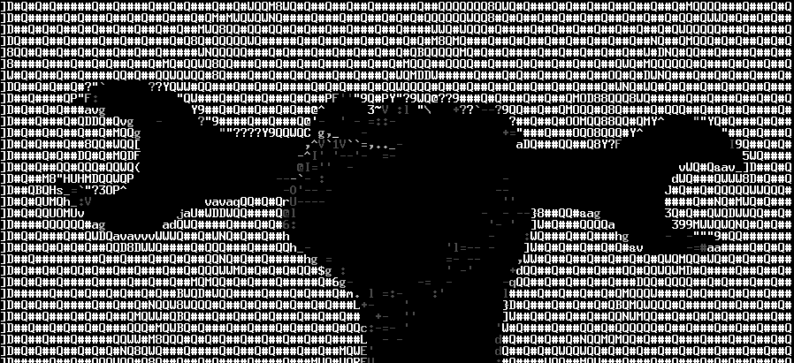

## Shtick

The most difficult part of learning and developing kubernetes applications is learning and 
configuring the many resources required to do so.
This repo provides a template for developing k8s clusters and cloud applications using k3d, helm, and tilt.
The idea is that you can fork the base_cluster project, modify it to your deployment/app/infrastructure/etc,
and rapidly develop new clusters, test out charts, and so forth.

The goals are purely for learning and development:
1) the ability to design, develop, and spin up clusters with different properties and resources
2) to rapidly design, develop and test cloud apps
3) to provide a learning environment, aka your own personal k8s playground

## Repo Organization
* */clusters*: create folders here containing content (helm charts, k3d startup, etc) describing a cluster
    * */base_cluster*: an example cluster
        * */go_app*: an example golang cloud application with some basic endpoints and a static page
        * */scripts*: just random or obsolete scripts

These are the main resources to understand:
| Resource | Description |
| :--- | :--- |
| */base_cluster/k3d_config.yaml* | The base cluster definition. Modify this to create clusters with different properties: nodes, volumes, etc. |
| */base_cluster/up.sh* | Defines starting, stopping, or deleting the cluster |
| */base_cluster/Tiltfile* | Drives tilt. Apps and development resources are defined here. |
| */base_cluster/go_app* |  Contains the helm chart and source code for an example app   |
| */base_cluster/go_app/chart* |  The helm chart and params for creating the go app's k8s objects. |
| */base_cluster/go_app/src* |  The source code for an extremely simple golang webapp; basically a dockerfile and a few dummy endpoints. |

## Pre-reqs
Install docker, k3d, helm, and tilt (see version_info.txt for versions)

## Workflow
Basic workflow:
1) cd into base_cluster/
2) create a k3d-development cluster: `./up.sh --create`
3) wait for cluster creation to complete: `kubectl get pods --all-namespaces`. It may take a few minutes to initially pull and install the cluster images (k3s, traefik, etc); pods will be shown as "ContainerCreating"; the cluster is ready when all pods show "Running" or "Completed".
4) poke around to get an idea of the cluster components:
    * view the nodes and registry: `docker container ls --all`
    * view the cluster running inside the nodes: `kubectl get pods -o wide --all-namespaces`
    * view host interfaces: `ifconfig`
    * know the namespaces (or they will trip you up): `kubectl get namespaces`
5) tilt up to run the go app:
    * `tilt up`, then open a browser
    * navigate to `localhost:10350`
    * after a minute or so, hit the go app at `localhost:8080/fortune`

## DevOps Resources
Software development is difficult enough because of all of the self-promotional pollution and overall lack of commitment to training by many of the companies for which we work.When I decided to learn kubernetes I made an intentional commitment to avoid online materials all together and instead learn solely from books. Some of the best:
1) [Kubernetes In Action](https://www.amazon.com/Kubernetes-Action-Marko-Luksa/dp/1617293725/)
2) [Kubernetes Patterns](https://www.amazon.com/Kubernetes-Patterns-Designing-Cloud-Native-Applications/dp/1492050288/)
3) [Design Patterns for Container-Based Distributed Systems](https://www.usenix.org/conference/hotcloud16/workshop-program/presentation/burns) (free and a quick read)
4) [K3d](https://k3d.io/v5.1.0/) [Quick tutorial](https://www.youtube.com/watch?v=mCesuGk-Fks)
5) [Helm](https://helm.sh/docs/intro/quickstart/) [Quick tutorial](https://www.youtube.com/watch?v=5_J7RWLLVeQ)
6) [Tilt](https://tilt.dev/) [Simple k3d tilt example](https://github.com/iwilltry42/k3d-demo/blob/main/Tiltfile)

I chose Go as an example app because its toolchain is so amenable to cloud development, by design. Two of my fave resources:
1) [The Go Programming Language](https://www.amazon.com/Programming-Language-Addison-Wesley-Professional-Computing/dp/0134190440)
2) [Concurrency in Go](https://www.amazon.com/Concurrency-Go-Tools-Techniques-Developers/dp/1491941197/)
3) Write throwaway code. Go does not bite your hand when you try to feed it, sell your personal data, or do that weird thing to your sweater when you put it through the dryer. I know, right? Tread softly, fellow devs, this is new territory...

## Credit
This repo was gratefully built atop k3d, docker, tilt, helm, k3s, and kubernetes--and google as well. All credit for these tools goes to their authors. Seriously, thanks a ton.

Some very helpful teachers:
* https://www.youtube.com/c/MarcelDempers
* https://www.youtube.com/c/DevOpsToolkit