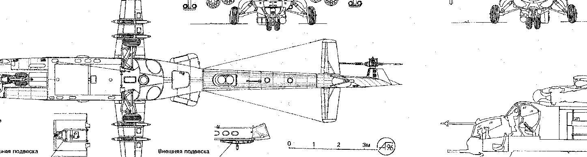

# Golang Kubernetes Webhook Minimal Working Example

This is a minimal working example of a mutating webhook.

Webhooks are powerful and simple constructs Kubernetes for modifying k8s objects
on specific events (get, create, patch, etc). See "Kubernetes Best Practices" for an
example, within one of the final chapters on extending kubernetes. Webhooks come in two
flavors, mutating and validating: mutators modify k8s objects, validators accept/reject
k8s objects downstream of mutators. As an side, as expected there are timing issues related
to the use of webhooks, for instance sidecar injection requires that the sidecar image is available,
and multiple webhooks may not obey an order/consistency property. Hence its presumably best
that webhooks implement simple and idempotent behavior.

Webhooks allow some more advanced kubernetes patterns and customizations. For instance, by watching for pod or other objects' creation, one can:
* inject sidecar definitions (currently how Istio injects Envoy proxies)
* enforce security or development rules
* other dynamical behavior, devops flows, and linting

As native constructs, webhooks are much simpler than full CRD/Operator patterns and their code-generation frameworks. Webhooks are easy to comprehend, as a webhook sits in a well-understood location in the k8s object pipeline, and likewise they are implemented using simple http interfaces. This means little to no tooling is required to build up complicated cluster logic, service meshes, and so forth.

# Code

The golang code is in . and in src/. See the mutatePod function; this is where a Pod definition could be modified and returned; currently it just logs a message to indicate the webhook has been called when a pod is deployed. Note that the entire webhook is merely a simple http endpoint and a bunch of kubernetes boilerplate.

# An Important Note

To allow deleting the entire example namespace, in this project I add the mutation webhook deployment to the same namespace as that which it operates upon. This requires that the webhook is running before the mutation-webhook configuration is added. Otherwise, the config is added and the api-server will reach-out but fail to receive a response from the hook it specifies, such that no pods can be added to the namespace. If this occurs, just delete the mutating webhook config and start over.

# Manual Deployment (vanilla build steps)

1) Build (ensure the image name matches in manifests):
    * docker buildx build -t 127.0.0.1:5000/simple-webhook -f DockerfileDebug .
    * docker push 127.0.0.1:5000/simple-webhook

2) Build the trust info (certs, secret, etc). Cd into dev/, then run 
./cert_gen.sh. There are a few prompts for some manual steps:
    * cd dev
    * ./cert_gen.sh
    * copy the CA bundle in the script output to the caBundle of the mutating-webhook yaml

3) Deploy to cluster, by executing these in order:
    * kubectl apply -f ./dev/manifests/namespace.yaml
    * kubectl apply -f ./dev/manifests/tls_secret.yaml
    * kubectl apply -f ./dev/manifests/deployment.yaml
    * kubectl apply -f ./dev/manifests/service.yaml

4) Await the simple-webhook pod. It may even be advisable to deploy a temporary tools pod to curl the app's /health endpoint, or use the kube api to do so, to confirm the service is running.
    * kubectl get po -l app=simple-webhook

5) Create the mutating webhook configuration.
    * kubectl create -f dev/manifests/mutating_webhook.yaml

6) Verify that the webhook is hit by creating any pod in its namespace:
    * kubectl run busybee -n webhook-example --image=busybox --command -- /bin/sh -c "sleep infinity"
    * kubectl logs [the webhook pod]
    * The logs should show 'hit webhook!' along with the time.

7) Cleanup:
    * kubectl delete ns webhook-example
    * kubectl delete mutatingwebhookconfiguration simple-webhook.acme.com

# Tilt Deployment
First make sure the cluster is free of any previous artifacts using the cleanup steps above.
Then merely run `tilt up` or `up.sh`. To tear down, run `down.sh`. Review the Tiltfile in case of any issues; it was very fragile when written, as enforcing sequential build steps was more difficult than it should have been (IOW, things could be working now by mere chance!).

# Lessons Learned

Developing a webhook is potentially very disruptive. Deployed to the wrong namespace, yaml
mistakes, etc., can leave the namespace in a state in which objects like pods cannot
be deployed, because they cannot pass the admission webhook. When developing a webhook,
evaluate the full impact and develop in an environment with minimal collateral damage.
Namespaces, labels, service names, state... they all tend to clash.

These concerns merely call out to correct development mechanisms to control the blast radius:
* adding/deleting and enabling/disable the webhook are first-class responsibilities: start
  coding these first before coding a full solution, and spiral outward toward lower risk.
* document in advance how to enable/disable the webhook.
    * label the webhook stack (deployment, service, etc) such that it can be enabled/disabled
    * delete the webhook-configuration, or merely ensure that it is easy to do so
    * include test resources for accept/reject (in the case of admissions) or expected/actual yaml (for mutation hooks)
* See other example projects' mechanisms. Elastic (ECK) uses the previous steps, which are
close to vanilla kubernetes.

# Security

The webhook requires its own cert and tls secret. This ca-bundle is added to the mutating-webhook-configuration spec that gets loaded into the api-server. This means that the api-server authenticates that it is speaking to your webhook, but the webhook itself defines that trust. The api-server trusts whatever has been loaded into it, to perform **full mutation** on kubernetes objects (according to the scope define in the MutatingWebhookConfiguration definition). Hence, security is only as strong as the security of the account that added the webhook.

The insider threat is probably the biggest of all: someone improperly accesses a service account capable of adding or modifying mutating webhook configuration. This could be inadvertent, such as a developer on a cluster who improperly scopes a mutating-webhook-configuration:
1) an incorrect namespace could leave that namespace unusable
2) a dysfunctional (e.g. in-development) webhook could render the namespace unusable or unstable

It could also be malicious:
1) api-server: hijacked ca-bundle causes server to trust unknown mutation webhook
2) webhook: mutation webhook image modified or service diverted to attackers implementation
3) api-server: attacker loads their own mutation webhook under a non-secured account

And so on. This is important because some projects encourage non-local development on collective clusters; per both quality security, for webhook development this seems extremely hazardous. It will also slow devs down by making them overly cautious about cluster matters unrelated to development (as they also learn webhooks and related apis). Don't make devs walk on eggshells! Webhook development is best done on disposable local clusters (e.g. k3d), where developers are free to create/destroy/break/modify. The risks become better understood by doing so anyway.

This evaluation is not complete, just food for thought.

# Future Work

Mutating webhooks can be used to build shrinkwrapping tools for linux capabilities, and various other system/security analyses: injecting monitoring sidecars into pod specifications that capture their used/required capabilities and generate the appropriate securityContext parameters, and so forth. Linux capabilities and securityContext specification is a messy affair. You may notice how often these features are mentioned (runAsUser, capabilities, etc) yet how fleetingly anyone describes *the method for deriving these profiles*, let alone reusable ones. One can see the value in similar security-oriented sidecars as a development aid, and a security posture analyzer. I'm still developing the use-cases.

For most microservices, merely dropping all caps and adding only CAP_NET_RAW suffices in 99% of cases, or applications ought to be designed such that such minimal sets are satisfiable. But the sidecar approach is still interesting. Offerings like `kubebench` offer many similar analyses.

# References

* Kubernetes Best Practices, 2020, Chapter 15
* [Slack webhook example code](https://github.com/slackhq/simple-kubernetes-webhook/blob/main/pkg/mutation/inject_env.go)
