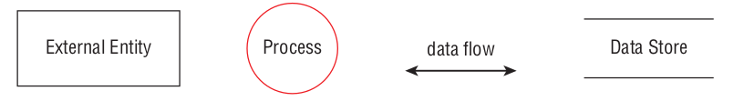
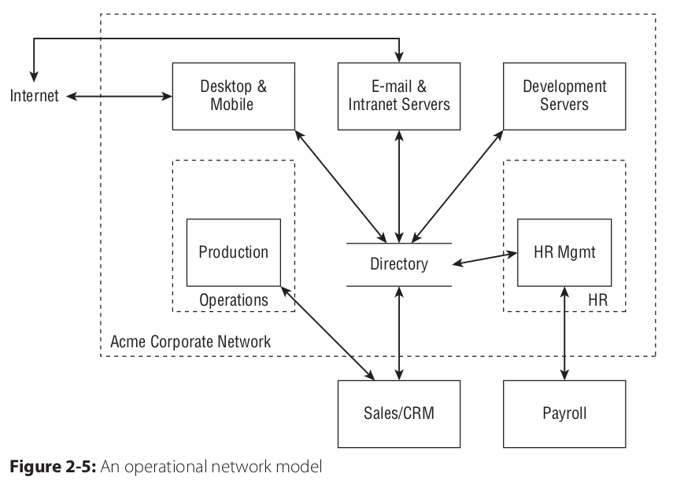

# Notes About App Architecture

Just some random notes, this is a huge subject.

## 12 Factor App Design

12 Factor App Design implements a few imperatives:
* declarative application management
* scalability (cattle, not pets)
* minimize divergence between environments, such as dev vs prod
* clean code contracts for OS and environment portability
* orthogonal logging

Not all of the factors have aged well. For instance, principle-12 "admin processes" advocates shelling into containers to baby them, which is explicitly discouraged in modern clouds apps. Manual configuration via shells creates snowflakes, pets, and drift. However it is still extremely useful for diagnostic, security, and development tasks.

The twelve factors:
1) Code base: there is always a 1:1 correlation between the codebase and the application, with the codebase managed by something like Git.
2) Dependencies: the application never depends on system-wide dependencies, and its dependencies are explicitly declared in a manifest. A good example is that Golang apps are all statically compiled and do not dynamically link to system dependencies outside the app.
3) Config: config is strictly separate from code, using environment variables and config-maps (k8s). Configuration must be able to change independently of code recompilation.
4) Backing services: these are treated as 'attached resources', that can be redeployed independently of the application. I dislike the vagueness of the term 'attached resource', but I believe the point is that an app should be coded to an interface, not an implementation, and should not require code changes when an external resources fails/is-replaced and so on.
5) Build, release, run: a build is the process of generating an executable package; a release combines the package with a config (dev, prod, etc), and a run is when the app is actually executed in an environment. These steps are strictly separated.
6) Processes: the app is executed as stateless process(es). No state exists in the app; state is held in stateful backing services (databases). A sneaky counter-example is response caching or maintaining sticky sessions or connections in an app or a user. Design for statelessness and horizontal scalability.
7) Port binding: the app binds to a specific port as a service. Thus apps can be as services decomposed as resource locations (urls), and managed in a decoupled manner (via k8s Services, load balancers, or more complex service mesh logic for example).
8) Concurrency: scale out via the Unix process model.
9) Disposability: apps should respond gracefully to suddent termination and must do the following:
    1) start up quickly
    2) respond quickly to SIGTERM
    3) not be "pets"
10) Dev/production parity: make development and production as similar as possible, not silos. Any backing services must be as similar as possible to production (file systems!!).

| | Traditional app | Twelve-factor app |
| --- | --- | --- |
| Time between deploys | Weeks | Hours |
| Code authors vs code deployers | Different people | Same people |
| Dev vs production environments | Divergent | As similar as possible |
11) Orthogonal logging: apps should treat logging as event streams, managing no log files or other special services, and merely logging to stdout. The logging infrastructure should then receive these event streams.
12) Admin processes: run management and admin processes as one-off processes, e.g. `kubectl exec mypod -- curl -i some-service.mynamespace.service.cluster.local`.

"Cloud Native Go" has a nice writeup on 12 Factor Apps for Golang. As more or less a cloud-native language, the corresponding between Golang and its library features are more or less 1:1 with 12 Factor principles:
1) code base: this is defined by things like Dockerfiles for dev containers, however the tooling of 'go build' 'go get' and the like is stable enough to meet the code-base requirement that what is built on one machine will be built the same on another.
2) dependencies: go modules explicitly declare and manage dependencies 
3) config: tools like Viper provide easy to use env-var interaction.
4) backing services: golang has many builtin resources for interacting with and communicating directly with common external services: sql/db drivers, serialization, gRPC, etc.
5) build, release, run: `go build`, vendoring, and other release management features.
6/7) Processes and ports: golang is directly amenable to building http/REST and gRPC interfaces quickly.
8) Concurrency: golang's concurrency model (particular well-crafted contexts and error handling)
9) Disposability: go's culture enocurages this

Factors 10-12 are infrastructural concerns, not code responsibilities, so go doesn't apply there. But its still probably pretty good :).

## Hexagonal Applications

Some people call this the predecessor to microservices, so I wouldn't read too much into the architectural, Fowler&Co jargon. The concept lends itself to a "ports and adapters", but is more or less just intuitive microservices design once you have a few years of experience with them.

## STRIDE, Threat Modeling, and Attack Trees

STRIDE and threat-modeling are a terrific design activity, even if you ignore its security responsibilities.
It deserves its own coverage, but in brief:
* STRIDE: spoofing, tampering, repudiation, information disclosure, denial of service, elevation of privilege

Attack trees: similar to a fish-bone causal diagram in terms of displaying causal inputs toward a goal. First,
draw a goal ("compromise key") around core protected elements in an architecture. Then draw the next layer of
adjacent events/acitivites which could lead to that goal being satisfied ("insider threat", "bad crypto", etc).
Each of these then has a set of its own inputs, and so on, until you reach initial external entities (the leaves of the tree). There are many example trees that describe the layout. Some implement formal definitions, such
as AND/OR gates over their inputs, and so on. 
* draw a goal state for an innermost item or trust-boundary
* draw inputs to that goal state, considering AND/ORs, but keeping the models simple and communicable
* refer to causal or security models like fish-bone or STRIDE to capture the full scope of threats (accidental, intentional, organizational, legal, etc).
What is likable about fish-bone is that it formally specifies that you define the following threats:
* the 6M's: method, material, manpower, measurement, machines, mother nature, management

Threat modeling:
1) define external entities first
2) identify threats; use STRIDE to define each threat across the entire system.
3) once found:
    * eliminate threats by eliminating features
    * mitigate threats (add passwords, complexity, etc)
    * apply indirection using things like password salts to multiply attacker's burden

Threat modeling diagrams are not just good for security, they're also great at-a-glance design docs.

Credit: Adam Shostack

| ELEMENT | APPEARANCE | MEANING | EXAMPLES |
|---|---|---|---|
| Process | rounded rectangle (classically circles) | any running code | pods, containers, programs |
| Data store | labeled pair of horizontal lines | tihngs that store data | sql db, process state (keys, sessions, etc) |
| Data flow | pointed arrow | communication between processes or stores | connections, read/write ops |
| External entities | rectangle with sharp corners | people or code outside one's control | third-party services, users, attackers |
| Trust boundaries | dotted boundaries | Transition between principals or from one trust-level to another (defined w.r.t principals) | userspace app principal, kernel, network boundary diode |

### Example Threat Model

Credit: Adam Shostack

Resources: see Shostack's "Threat Modeling" book for greater detail.

## Secure by Design

securityContexts: in kubernetes, often dropping all capabilities and then adding only net_cap_raw
is sufficient to run an http-based microservice. 
* drop all caps and add only net_cap_raw
* set up a readonly root file system
* run as non-root, however possible
* ensure resources are upper bounded by setting a resourceQuota
* use well-defined RBAC to scope service accounts and actions
